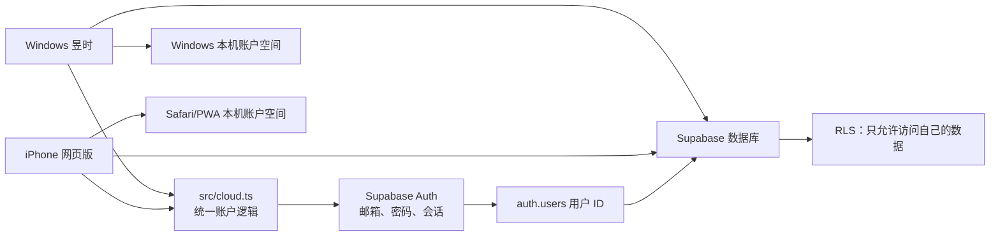
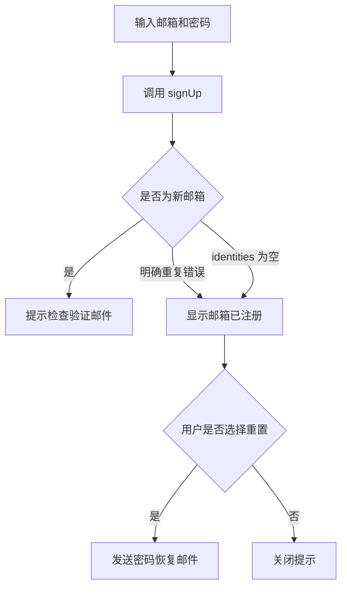
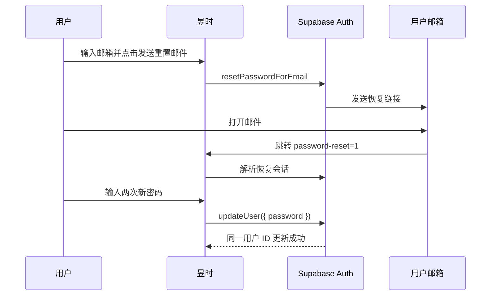

# 昱时：注册与账户管理说明

更新日期：2026-10-04  
适用范围：Windows 电脑端、iPhone 网页版、Supabase 云同步  
线上入口：<https://yuquanzhao9.github.io/yushi-app/>

## 1. 当前实现概览

昱时使用 Supabase Auth 管理邮箱账号和登录会话，使用 Supabase PostgreSQL 保存按账号隔离的日程、清单、课表和推送订阅。Windows 与 iPhone 网页版复用 `src/cloud.ts` 中的注册、登录、密码恢复和密码更新逻辑。

账户功能包括：

- 邮箱和密码注册。
- 邮箱和密码登录。
- 登录会话在当前设备持久化并自动刷新。
- 注册已存在邮箱时，显示“该邮箱已被注册”，再询问是否发送重置密码邮件。
- 未登录时可请求密码恢复邮件。
- 恢复链接打开手机网页版的新密码页面。
- 已登录设备可直接修改密码。
- 仅退出当前设备，不主动清除该账号保存在本机的日程副本。
- 本机未登录空间与各云账号的数据空间分开保存，由用户明确选择是否合并。

应用不提供查看旧密码的能力。Supabase Auth 只保存密码哈希，忘记密码时只能设置新密码。

## 2. 组件关系



账号的核心标识是 Supabase 用户 ID。修改密码不会创建新账号，也不会改变用户 ID，因此不会改变云端日程的所有权。

## 3. 云连接配置

### 3.1 正式版本

正式版本在构建时读取仓库根目录 `.env.local` 中的：

```text
VITE_SUPABASE_URL
VITE_SUPABASE_KEY
```

`web/vite.config.ts` 使用 `envDir: '..'`，保证从 `web/` 子目录构建手机网页时仍能读取仓库根目录的配置。该设置是在首次密码恢复页发布后修复的；最终网页发布提交为 `f9a4b28`。

正式手机网页已经内置云项目地址和 Publishable key，新设备应直接显示邮箱登录框，不应要求普通用户填写 Supabase 项目地址。

### 3.2 密钥边界

客户端只能使用 Supabase Publishable key 或旧版 anon key。`normalizeCloudSettings()` 会拒绝：

- 非 HTTPS 项目地址。
- 地址中夹带的账号、密码、查询参数或锚点。
- 格式无效的客户端密钥。
- `sb_secret_` Secret key。
- JWT 中角色为 `service_role` 的密钥。

Publishable/anon key 本来就会出现在客户端构建中。数据安全依赖登录身份和数据库 RLS；`service_role` 密钥不得进入 Windows 包、手机网页、源码提交或用户设置。

## 4. 会话生命周期

`createCloudClient()` 创建 Supabase 客户端时启用：

```text
persistSession: true
autoRefreshToken: true
```

这意味着登录会话保存在当前设备，由 Supabase 客户端自动更新访问令牌。应用自己的业务数据不保存明文密码。

Windows 端默认使用 `detectSessionInUrl: false`。手机网页版使用 `detectSessionInUrl: true`，用于解析邮箱验证和密码恢复链接中的会话信息。

两端都监听 `onAuthStateChange`：

- 获得有效会话时，切换到该用户 ID 对应的本机数据空间并启动云同步。
- 当前设备退出时，切回未登录的本机空间。
- 手机网页版收到 `PASSWORD_RECOVERY` 事件时，自动打开“我的”页面并显示新密码表单。

## 5. 注册流程

用户输入邮箱和密码后，应用调用：

```text
supabase.auth.signUp({ email, password })
```

邮箱会先去除首尾空格。注册结果分为三类：

1. **新邮箱**：注册成功。启用邮箱确认时，用户需要打开确认邮件后再登录。
2. **明确重复错误**：Supabase 返回 `User already registered`。
3. **隐藏式重复结果**：启用邮箱确认及防账号枚举行为时，Supabase 可能返回一个 `identities` 为空的伪装用户。

第 2、3 类都会转换为 `alreadyRegistered: true`，界面显示：

> 该邮箱已被注册。是否发送重置密码邮件？

用户可选择：

- **发送重置邮件**：调用密码恢复流程。
- **暂不**：关闭提示，不发送邮件。

应用不会仅因为检测到重复邮箱就自动发信。



## 6. 登录流程

登录调用：

```text
supabase.auth.signInWithPassword({ email, password })
```

登录成功后：

1. `onAuthStateChange` 得到用户会话。
2. 应用取得 Supabase 用户 ID。
3. 本机存储切换到该项目和该用户专属的数据空间。
4. 应用加载该空间的本机副本。
5. 应用开始拉取、合并和上传该账号的云端数据。

登录本身不会把未登录空间的数据自动上传。用户需要点击“将本机任务合并到此账号”或“把未登录时记下的日程并入此账号”。这可防止登录错误账号时误传本机资料。

## 7. 重复邮箱提示与密码恢复

### 7.1 请求恢复邮件

登录页的“忘记密码？发送重置邮件”调用：

```text
supabase.auth.resetPasswordForEmail(email, {
  redirectTo: 'https://yuquanzhao9.github.io/yushi-app/?password-reset=1'
})
```

用户必须主动点击按钮。应用不会在打开页面、输入邮箱或注册失败时自动发送邮件。

Supabase 项目必须允许以下恢复地址：

```text
https://yuquanzhao9.github.io/yushi-app/**
```

邮件是否送达还受 Supabase 邮件服务、SMTP 设置、频率限制、收件箱和垃圾邮件过滤影响。

### 7.2 打开恢复链接

手机网页版会同时识别：

- 查询参数 `password-reset=1`。
- Supabase 会话事件 `PASSWORD_RECOVERY`。
- 回调中 `type=recovery` 的恢复标记。

识别成功后，页面打开“我的”页并显示两个新密码输入框。

### 7.3 保存新密码

两次输入一致且不少于 8 位后，应用调用：

```text
supabase.auth.updateUser({ password: newPassword })
```

成功后清除恢复地址中的临时查询参数和锚点。该操作更新同一 Supabase 用户，不创建新用户，也不修改日程的 `user_id`。



## 8. 已登录修改密码

Windows 与手机网页版的账号区域都提供“修改密码”。当前会话有效时，用户可以直接输入两次新密码并调用同一个 `updatePassword()` 逻辑。

应用侧要求：

- 新密码至少 8 位。
- 两次输入必须一致。
- 不接收或显示旧密码。

Supabase 项目如果启用了重新认证或“修改密码时必须提供当前密码”，服务器仍可能要求额外验证；应用会显示服务器返回的错误。

## 9. 退出登录

退出调用：

```text
supabase.auth.signOut({ scope: 'local' })
```

`scope: 'local'` 只退出当前设备的当前会话。应用随后切回未登录数据空间，但不会主动删除：

- 该账号在本机保存的日程副本。
- 云端属于该用户 ID 的数据。
- 其他设备上的本机副本。

密码更新或退出后，Supabase 仍可能根据项目的会话策略让其他设备重新登录；这不会删除云端日程。

## 10. 本机数据隔离与保留

未登录空间使用：

```text
shiri-data:local
```

登录后的空间使用：

```text
shiri-data:<Supabase 项目 origin>:<用户 ID>
```

这样可以避免：

- A 账号打开 B 账号的本机数据。
- 不同 Supabase 项目之间的数据混用。
- 用户一登录就自动覆盖未登录时记录的日程。

修改密码只改变 Auth 凭据，不改变存储键中的用户 ID。只要仍使用同一个 Supabase 账号，原有数据空间和云端所有权保持不变。

不要在确认同步完成前卸载应用、删除主屏幕 PWA、清除 Safari 网站数据或手动删除 `%APPDATA%\拾日`。

## 11. 云端数据隔离

核心表都包含 `user_id`，并引用 `auth.users(id)`。数据库启用 Row Level Security：

- `select` 只能读取 `auth.uid() = user_id` 的行。
- `insert` 只能写入自己的 `user_id`。
- `update` 和 `delete` 只能操作自己的行。
- 匿名角色没有业务表权限。

同步 RPC 还接收 `expected_user`。如果同步过程中登录账号发生变化，RPC 会拒绝请求，避免把前一个账号的快照上传到后一个账号。

目前相关数据包括：

- `shiri_tasks`：日程与删除标记。
- `shiri_lists`：清单名称和颜色。
- 课表数据表及同步逻辑。
- `shiri_push_subscriptions`：当前账号的网页推送订阅。
- `shiri_push_sent`：由云函数维护的已发送记录，普通客户端无权限。

## 12. 用户可见错误

`cloudErrorMessage()` 将常见 Supabase 错误转换为中文：

| 情况 | 用户提示 |
|---|---|
| 邮箱或密码错误 | 邮箱或密码不正确。 |
| 邮箱尚未确认 | 请先打开邮箱中的确认邮件，再登录。 |
| 邮箱已注册 | 此邮箱已经注册，请直接登录。 |
| 密码强度不足 | 密码强度不足，请使用更长的密码。 |
| 请求过于频繁 | 操作太频繁，请稍后再试。 |
| 网络失败 | 无法连接同步服务；本机任务仍已保留。 |
| 数据库脚本未准备 | 提示先运行 `cloud/schema.sql`。 |

重复邮箱注册在进入通用错误映射前会优先显示带“发送重置邮件/暂不”按钮的专用提示。

## 13. Windows 与手机网页版差异

| 项目 | Windows | iPhone 网页版 |
|---|---|---|
| 登录会话 | Electron 本机资料目录 | Safari/PWA 网站存储 |
| 云配置 | 正式包内置，也保留设置入口 | 正式网页内置，也保留手动配置回退 |
| 恢复邮件入口 | 有 | 有 |
| 恢复邮件的新密码页面 | 跳转到公开手机网页 | 当前网页直接处理 |
| `detectSessionInUrl` | 关闭 | 开启 |
| 已登录修改密码 | 有 | 有 |
| 退出范围 | 当前设备 | 当前设备 |

当前密码长度入口仍有一处差异：Windows 登录/注册按钮要求至少 8 位后启用；手机网页登录/注册按钮目前在 6 位后启用；修改密码和恢复密码统一要求至少 8 位。最终是否接受仍由 Supabase 项目密码策略决定。后续应统一登录与注册界面的说明和启用条件，同时避免阻止仍在使用较短旧密码的账号登录。

## 14. 主要代码位置

| 文件 | 责任 |
|---|---|
| `src/cloud.ts` | 云配置校验、创建客户端、注册、登录、退出、密码恢复、密码更新、错误翻译、任务同步 |
| `src/App.tsx` | Windows 账户界面、会话切换、账号数据空间、修改密码、合并本机任务 |
| `web/src/App.tsx` | 手机账户界面、恢复链接处理、`PASSWORD_RECOVERY`、新密码页面 |
| `web/src/sync.ts` | 手机云配置和按项目/用户 ID 生成本机存储键 |
| `web/vite.config.ts` | 从仓库根目录读取正式云配置 |
| `cloud/schema.sql` | 日程表、RLS 和合并 RPC |
| `cloud/schema-v2.sql` | 清单、Realtime、推送订阅和 RLS |
| `tests/auth.test.ts` | 注册重复检测、恢复邮件和密码更新单元测试 |

## 15. 已验证内容

账号相关单元测试覆盖：

1. 明确的重复注册错误转为重置提示。
2. `identities` 为空的隐藏式重复注册结果。
3. 新邮箱不会被误判为重复邮箱。
4. 恢复邮箱会去除空格并使用正式恢复地址。
5. 少于 8 位的新密码在请求服务器前被拒绝。
6. 更新密码只向 Supabase 发送新密码，不创建新账号。

整体验证结果：

- 35 项 TypeScript 测试通过。
- 33 项桌面 Node 测试通过。
- 11 项手机网页测试通过。
- Windows 隐藏启动与账户入口检查通过。
- 手机恢复页面隐藏加载检查通过。
- 无历史配置的手机网页构建直接显示登录框。
- 线上 GitHub Pages 返回 HTTP 200，并加载包含内置云项目、重复邮箱提示和密码恢复逻辑的 `assets/index-2-S6k028.js`。

尚未由自动化测试代替用户完成的步骤：

- 真实邮箱的恢复邮件送达。
- 用户点击真实恢复链接后设置新密码。
- 修改密码后电脑与 iPhone 使用新密码重新登录。
- Supabase SMTP、重定向白名单和频率限制的长期运行验证。

## 16. 当前未提供的账户功能

- 查看或找回原明文密码。
- 在应用内删除账号。
- 团队账号、共享日历或成员权限。
- 多因素认证界面。
- 端到端加密。
- 管理员代用户设置或读取密码。

如果以后增加“删除账号”，必须先提供数据导出、明确说明云端级联删除结果，并要求用户再次确认；不能把退出登录当成删除账号。
